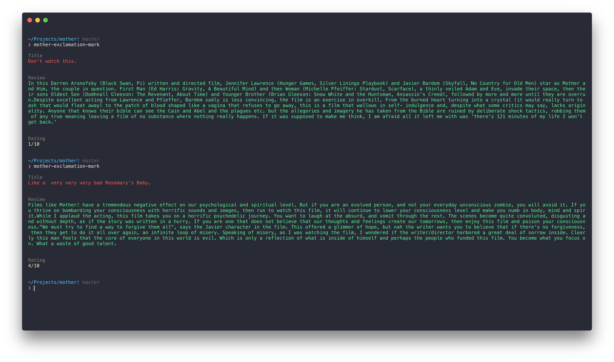

# mother [](https://travis-ci.org/SaraVieira/mother)

> Why use lorem when you can use random reviews from mother! ?



Inspired by Javi Velasco and all the Agent Conf Crew.

I cannot recommend this module though

## Install

```
$ yarn add mother-exclamation-mark
```

## Usage

```js
const mother = require('mother-exclamation-mark');

mother();
//=> mother review with an object containing title, content and rating

mother({ bad: true });
//=> bad mother review
```

## API

### mother({options})

#### options

##### good

Type: `boolean`<br>
Default: `false`

Returns a good review for mother!

##### bad

Type: `boolean`<br>
Default: `false`

Returns a good review for mother!

## CLI

```
$ yarn global add mother-exclamation-mark
```

```
$ mother-exclamation-mark --help

	Usage
	  $ mother-exclamation-mark

	Examples
	  $ mother-exclamation-mark --good
	  a bad review
	  $ mother-exclamation-mark --bad
	  a good review
```

## License

WTFPL © [Sara Vieira](http://iamsaravieira.com)
